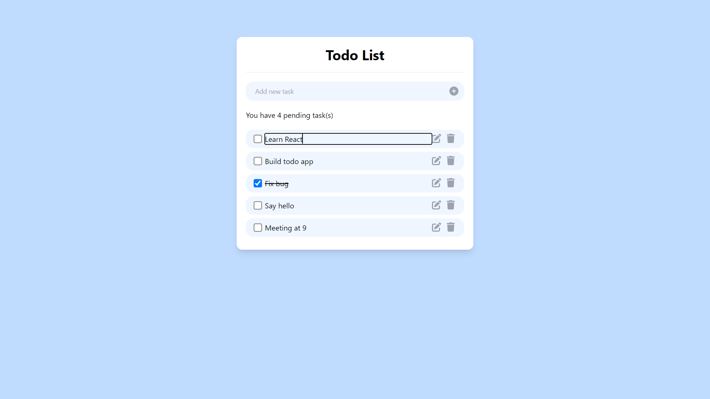

# Todo App

## Description

This is a simple Todo web application built with React. It allows users to manage their tasks by adding, deleting, editing, and marking tasks as completed.


## Check out the [App Demo](https://rithrita-kong.github.io/React-Todo-App/)

## Getting Started

To get a local copy up and running follow these simple steps:

1. Clone the repository:

   ```bash
   git clone https://github.com/Rithrita-Kong/React-Todo-App.git
   ```

2. Navigate into the project directory:

   ```bash
   cd React-Todo-App
   ```

3. Install dependencies:

   ```bash
   npm install
   ```

4. Start the development server:

   ```bash
   npm start
   ```

5. Open your browser and go to `http://localhost:3000` to view the app.

## Features:

- **Add Task:** Users can add new tasks to the list by entering task names and clicking the "Add" button.
- **Delete Task:** Users can delete tasks from the list by clicking the delete button next to each task.
- **Edit Task:** Users can edit task names directly inline by clicking the edit button next to each task.
- **Mark Task as Completed:** Users can mark tasks as completed by checking the checkbox next to each task.
- **Persisted State:** The application's state is persisted using React's state management, ensuring that tasks remain saved even after page refresh.

## Available Scripts

In the project directory, you can run:

### `npm start`

Runs the app in the development mode.\
Open [http://localhost:3000](http://localhost:3000) to view it in your browser.

The page will reload when you make changes.\
You may also see any lint errors in the console.

### `npm test`

Launches the test runner in the interactive watch mode.\
See the section about [running tests](https://facebook.github.io/create-react-app/docs/running-tests) for more information.

### `npm run build`

Builds the app for production to the `build` folder.\
It correctly bundles React in production mode and optimizes the build for the best performance.

The build is minified and the filenames include the hashes.\
Your app is ready to be deployed!

See the section about [deployment](https://facebook.github.io/create-react-app/docs/deployment) for more information.

### `npm run eject`

**Note: this is a one-way operation. Once you `eject`, you can't go back!**

If you aren't satisfied with the build tool and configuration choices, you can `eject` at any time. This command will remove the single build dependency from your project.

Instead, it will copy all the configuration files and the transitive dependencies (webpack, Babel, ESLint, etc) right into your project so you have full control over them. All of the commands except `eject` will still work, but they will point to the copied scripts so you can tweak them. At this point you're on your own.

You don't have to ever use `eject`. The curated feature set is suitable for small and middle deployments, and you shouldn't feel obligated to use this feature. However we understand that this tool wouldn't be useful if you couldn't customize it when you are ready for it.
